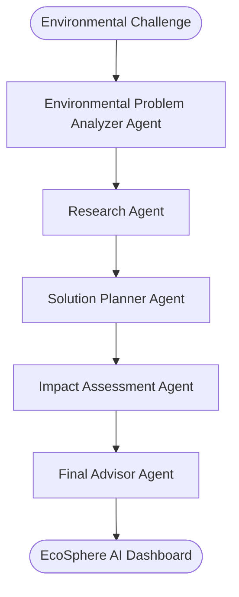

# EcoSphere AI 🌍🤖


## 🎥 Demo Video
https://github.com/user-attachments/assets/ea34d1c3-529f-4c29-914d-9e7124d48cb4


**Autonomous AI Sustainability Intelligence Platform**

EcoSphere AI is a full-stack multi-agent sustainability intelligence system that analyzes environmental challenges and generates practical, data-driven climate solutions.

Built using an **ADK Multi-Agent Architecture** and **MCP Server Design**, the platform enables users to describe sustainability challenges and receive structured advisory reports including environmental analysis, recommended actions, implementation timelines, impact estimation, and knowledge-backed insights.

Designed for the **Kaggle AI Agent Intensive Vibe Coding Capstone — Freestyle Track**, demonstrating a production-style local-first agent workflow.

---

# 🚀 Key Features

* **AI Sustainability Advisory System**

  * Converts environmental challenges into actionable sustainability strategies.

* **ADK Multi-Agent Collaboration**

  * Includes specialized agents working together:

    * Environmental Problem Analyzer Agent
    * Research Agent
    * Solution Planner Agent
    * Impact Assessment Agent
    * Final Advisor Agent

* **MCP Server Architecture**

  * Provides controlled access to:

    * Sustainability knowledge retrieval
    * Environmental analysis tools
    * Impact calculation utilities

* **Local-First AI Workflow**

  * Runs with a simulated offline environment without dependency on external APIs.

* **Premium Sustainability Dashboard**

  * Modern dark eco-tech interface built using React, Vite, and custom CSS.

* **Interactive Sustainability Report**

  * Generates:

    * Problem analysis
    * Research insights
    * Action roadmap
    * Environmental impact summary
    * References

* **Impact Intelligence**

  * Calculates sustainability indicators:

    * Carbon reduction
    * Water conservation
    * Waste reduction
    * Estimated benefits

* **Secure Agent Execution**

  * Includes:

    * Input validation
    * Safe tool execution
    * Error handling
    * Injection protection

---

# 🏗️ System Architecture

## 1. ADK Multi-Agent Workflow

The system uses a sequential agent pipeline where each agent improves the previous context.



---

# 2. MCP Server Architecture

EcoSphere AI uses an MCP-style tool layer to separate agent reasoning from utility operations.

Agents communicate with tools through:

```text
executeMCPTool(toolName, parameters)
```

Available tools:

### verify_input_safety

* Validates user input
* Detects unsafe patterns
* Prevents malicious execution

### get_documents

* Searches local sustainability knowledge base
* Retrieves relevant environmental information

### calculate_sustainability_impact

* Calculates estimated:

  * Carbon impact
  * Water savings
  * Waste reduction
  * Financial benefits

---

# 📁 Repository Structure

```text
EcoSphere_AI/

├── backend/
│   ├── src/
│   │   ├── agents/
│   │   │   ├── analyzerAgent.js
│   │   │   ├── researchAgent.js
│   │   │   ├── plannerAgent.js
│   │   │   ├── impactAgent.js
│   │   │   └── advisorAgent.js
│   │   ├── mcp/
│   │   │   ├── mcpServer.js
│   │   │   └── tools/
│   │   │       ├── knowledgeBase.js
│   │   │       ├── calculator.js
│   │   │       └── validator.js
│   │   └── server.js
│   ├── data/
│   │   └── sustainability_db.json
│   └── package.json
├── frontend/
│   ├── src/
│   │   ├── components/
│   │   │   ├── ProblemInput.jsx
│   │   │   ├── StatusTracker.jsx
│   │   │   ├── ReportViewer.jsx
│   │   │   ├── TimelineView.jsx
│   │   │   └── ImpactSummary.jsx
│   │   ├── App.jsx
│   │   └── index.css
│   └── package.json
└── README.md
```

---

# 🛠️ Installation & Setup

Requirements:

* Node.js v18+

---

## Backend Setup

```bash
cd backend

npm install

npm start
```

Backend runs:

```text
http://localhost:5000
```

---

## Frontend Setup

```bash
cd frontend

npm install

npm run dev
```

Frontend runs:

```text
http://localhost:3000
```

---

# 🔄 End-to-End Workflow

Example:

User:

> "How can my university reduce food waste?"

Process:

1. **Analyzer Agent**

   * Understands the environmental issue

2. **Research Agent**

   * Retrieves sustainability knowledge

3. **Planner Agent**

   * Creates implementation roadmap

4. **Impact Agent**

   * Estimates possible environmental benefits

5. **Advisor Agent**

   * Generates final sustainability intelligence report

Output:

* Problem Analysis
* Recommended Actions
* Timeline
* Impact Summary
* References

---

# 🔒 Security Features

EcoSphere AI includes:

### Input Protection

* Input sanitization
* Length validation
* Unsafe content filtering

### Safe Tool Execution

* Controlled MCP tool access
* Isolated execution flow

### Error Handling

* Agent failure recovery
* Safe fallback responses
* Frontend error protection

---

# 🧪 Testing

The system verifies:

* Agent workflow completion
* Input validation
* MCP tool execution
* Knowledge retrieval
* Impact calculation accuracy

Run:

```bash
npm test
```

---

# 🌱 Future Improvements

* PDF sustainability report export
* Excel impact data export
* Sustainability score generation
* SDG goal mapping
* Personalized follow-up AI advisor
* Historical report storage

---

# 🎯 Project Vision

EcoSphere AI demonstrates how autonomous AI agents can transform environmental knowledge into practical sustainability decisions.

By combining:

* Multi-Agent AI
* MCP Tool Architecture
* Secure execution
* Environmental intelligence

the platform acts as an AI sustainability consultant for real-world climate challenges.
